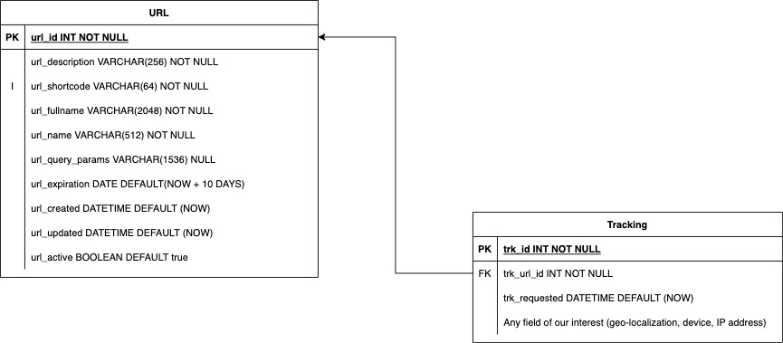
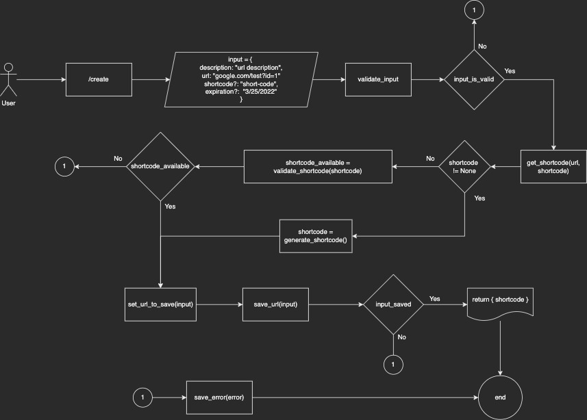
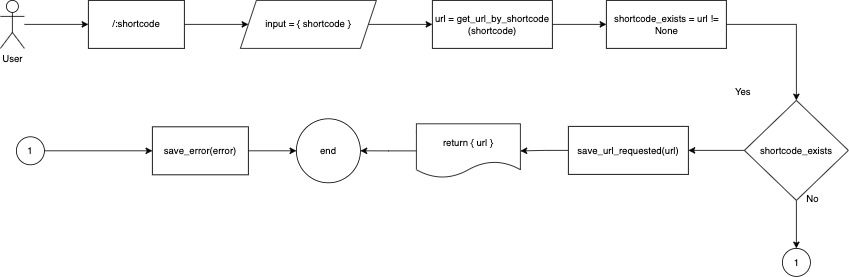

# URL Shortener

## What is?

A URL Shortener is a service that creates short aliases for URLs. It generates a shortcode for a URL and then redirects the user to the URL when that code is accessed. You make anURL simple, small and clean.

## Why?

1. Clean and Simple URLs.
2. We can track Links and study an audience.
3. Clean social media posts.
4. Reduce SMS marketing costs (billed by text sended)
5. Customize brand links (like: fondeadora.com/tu-nueva-tarjeta)

## Requirements

- Web API builded with Python 3.
- Docker
- Using a relational database (like Postgres)

## Scope

This application have two endpoints:

- POST /create: accepts a URL (with parameters) and returns a shortcode.
- GET /:shortcode: accepts a shortcode and returns the original URL.

## Database

This database is pretty simple:

- We have an URL table with the necessary information of a generated shortlink. We included some business rules:
  - Separation between an URL and their parameters (if it has).
  - Expiration date thinking about campaigns or social media contests, for instance.
  - Index for `url_shortcode` because it’s a field very requested TODO: Change this definition
- A table called Tracking to save data about a requested shortcode and, maybe, its localization, IP address, etc.

## Flows

### /create

- Start
- User go to /create
- Input received with data:
  - description: a description for an url
  - url: the value to be shortened
  - shortcode (optional): a custom value for the shorted
  - expiration (optional): date of expiration of for a shortcode
- Input validation
  - Description and url required
  - If we have a shortcode, validate its length (< 64)
  - If we have a expiration date, validate time in days (+1)
- Get a shortcode
  - If we receive a custom shortcode, validate if doesn’t exist
- Prepare data to save by received input
- Save url in database
- Verify if input was saved
- Return shortcode

### /:shortcode

- Start
- User go to /:shortcode
- Get shortcode by /:shortcode
- Get url by shortcode
- If doesn’t exist a shortcode
  - Throw an error
- Save url requested
- Return url

## Running

### Minimal requirements

- Docker
- docker-compose
- `make` to running commands easier

We have three commands in `makefile` in order to access easily to this project

- `build` (`docker-compose build`): build Docker image.
- `up`: (`docker-compose up -d`): initialize Docker image in background
- `down`: (`docker-compose down`): delete Docker container.
- `test`: (`cd url_shortener && python3 manage.py test --pattern="tests*.py"`): run all unit test (You need to create a virtualenv and install requirements to run this)

## Documentation

`fondeadora.postman_collection.json` had examples about how to use this project.
